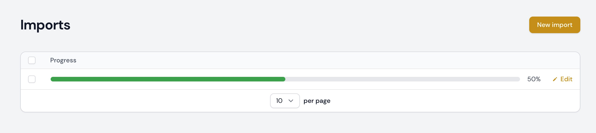

# Add a progress bar column to your Filament tables.

[](https://packagist.org/packages/ryangjchandler/filament-progress-column)
[](https://github.com/ryangjchandler/filament-progress-column/actions?query=workflow%3Arun-tests+branch%3Amain)
[](https://github.com/ryangjchandler/filament-progress-column/actions?query=workflow%3A"Check+%26+fix+styling"+branch%3Amain)
[](https://packagist.org/packages/ryangjchandler/filament-progress-column)

This package provides a `ProgessColumn` that can be used to display a progress bar in a Filament table.

## Installation

You can install the package via Composer:

```bash
composer require ryangjchandler/filament-progress-column
```

If you're **not** using the `filament/admin` package, you should also add the following line to the top of your CSS:

```css
@import '../../vendor/ryangjchandler/filament-progress-column/resources/dist/progress.css'
```

Optionally, you can publish the views using

```bash
php artisan vendor:publish --tag="filament-progress-column-views"
```

## Usage

Add the `ProgressColumn` to your table:

```php
use RyanChandler\FilamentProgressColumn\ProgressColumn;

protected function getTableColumns(): array
{
    return [
        ProgressColumn::make('progress'),
    ];
}
```

This will render a progress bar and used the value of `$record->progress` as the current progress.

<p align="center">
    
</p>

### Dynamic progress calculation

If you wish to calculate the progress dynamically, provide a `Closure` to the `ProgressColumn::progress()` method.

```php
protected function getTableColumns(): array
{
    return [
        ProgressColumn::make('progress')
            ->progress(function ($record) {
                return ($record->rows_complete / $record->total_rows) * 100;
            }),
    ];
}
```

### Polling

If you would like your progress bar to update after a period of time, call the `ProgressBar::poll()` method and provide a valid modifier string for the `wire:poll` directive.

```php
protected function getTableColumns(): array
{
    return [
        ProgressColumn::make('progress')
            ->poll('5s')
    ];
}
```

This will result in a `wire:poll.5s` directive being added to the column and the value of your progress bar will update every 5 seconds.

#### Dynamic polling

There might be scenarios where you only want to poll if some condition is met. This can be achieved by returning `?string` from a `Closure`.

```php
protected function getTableColumns(): array
{
    return [
        ProgressColumn::make('progress')
            ->poll(function ($record) {
                return $record->progress < 100 ? '5s' : null;
            })
    ];
}
```

Now the progress bar will only be updated every 5 seconds **if** the progress is less than 100.

### Colors

By default, the progress bar will be the same as your `primary` color. If you wish to change this, provide a new string to `ProgressBar::color()`.

```php
protected function getTableColumns(): array
{
    return [
        ProgressColumn::make('progress')
            ->color('warning'),
    ];
}
```

With a [custom filament theme](https://filamentphp.com/docs/2.x/admin/appearance#building-themes) you can add `'./app/Filament/Resources/*.php'` to the `content` section in `tailwind.config.js` so colors won't get purged and create [gradient colors](https://tailwindcss.com/docs/gradient-color-stops#middle-color) like

```php
protected function getTableColumns(): array
{
    return [
        ProgressColumn::make('progress')
            ->color('bg-gradient-to-r from-indigo-500 via-purple-500 to-pink-500'),
    ];
}
```

### Dynamic color calculation

If you wish to calculate the color dynamically, provide a `Closure` to the `ProgressColumn::color()` method.

```php
protected function getTableColumns(): array
{
    return [
        ProgressColumn::make('progress')->color(function ($record){
            return $record->progress > 50 ? 'primary' : 'success';
        })
    ];
}
```

## Testing

```bash
composer test
```

## Changelog

Please see [CHANGELOG](CHANGELOG.md) for more information on what has changed recently.

## Contributing

Please see [CONTRIBUTING](.github/CONTRIBUTING.md) for details.

## Security Vulnerabilities

Please review [our security policy](../../security/policy) on how to report security vulnerabilities.

## Credits

- [Ryan Chandler](https://github.com/ryangjchandler)
- [All Contributors](../../contributors)

## License

The MIT License (MIT). Please see [License File](LICENSE.md) for more information.
